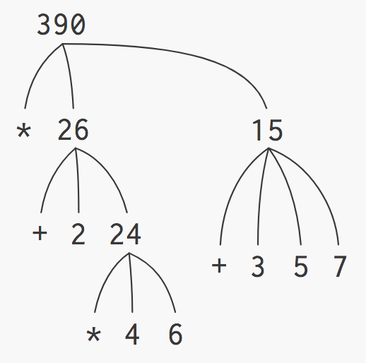
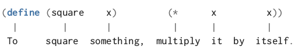

<!-- $theme: default -->

<style type="text/css">
html, body, div, p { font-family: Helvetica; }
</style>


---


---

https://repl.it/languages/scheme

---

Всеки мощен език за програмиране ни дава 3 основни средства за организация на нашите идеи при решаването на даден проблем:

- **примитивни изрази** - най-простите елементи
- **средства за комбинация** - за създаване на съставни елементи от по-прости
- **средства за абстракция** - за именоване на съставни елементи, които да използваме като примитивните елементи

---

# Израз

Infix notation
```
1 + 2
```

Prefix notation
```Scheme
(+ 1 2)
(+ 1 2 3 4 5) ;повече аргументи
```

---

# Атоми

## Примитивните изрази в езика

```Scheme
42
3.14
#t
#f
```

---


---

# Комбинации

## Средствата за комбинация в езика

```Scheme
(operation operand1 operand2 ...)
```

```Scheme
(sum-of-squares 2 3)
```


```Scheme
(+ (* 2 2) (* 3 3))
```

---

# Вградени процедури

## Te също са изрази

`+`, `-`, `*`, `/`, `remainder`, `quotient`, `modulo`

---

# Вградени предикати

## Те също са процедури

`=`, `<`, `>`, `<=`, `>=`, `and`, `or`

---

“Lisp programmers know the value
of everything but the cost of nothing.”
--
*<div style="text-align: right">Alan Perlis
 (paraphrasing Oscar Wilde)</div>*

---

# Оценка на комбинация

`(подизраз1 подизраз2 подизраз3 ...)`

1. Оценяваме всички под-изрази в комбинацията (списъка).

`(процедура аргумент1 аргумент2 ...)`

2. Прилагаме стойността на най-левия подизраз (`процедура`) върху аргументите, които са стойностите на останалите подизрази.

---

# Оценете комбинацията

```Scheme
(* (+ 2 (* 4 6))
   (+ 3 5 7))
```

---

# TODO: add new diagram



---

# Именуване на израз
## Средство за абстракция

```Scheme
(define grade 6)
```

```Scheme
(define answer
  (+ 3
     (* 3 13)))
```

```Scheme
(define + -)
```

---

# Дефиниране на процедура
## По-мощно средство за абстракция



<br/>

```Scheme
(define (sum-of-squares x y)
  (+ (square x) (square y)))
```

---

# Прилагане на процедура

```Scheme
(square 7) ;49
```

```Scheme
(sum-of-squares 3 4) ;25
```

```Scheme
(sum-of-squares (+ 1 2) (* 2 2)) ;25
```
