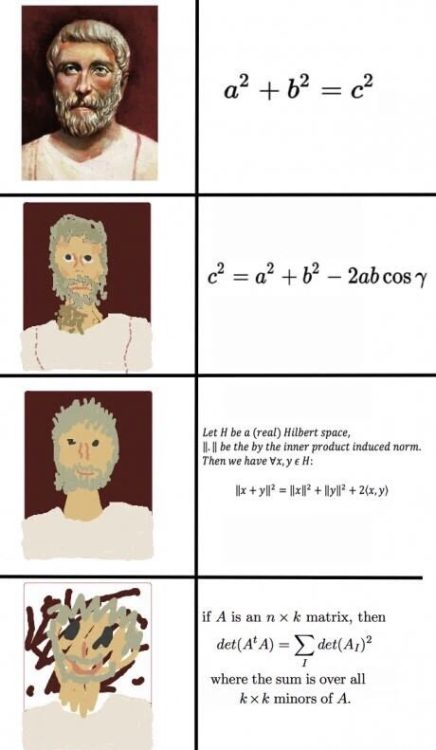

<style type="text/css">
html, body, div, p { font-family: Helvetica; }
</style>

# Процедури от по-висок ред

---

# Сума

$$\sum_{x = a}^b x$$

---

# Сума

$$\sum_{x = a}^b x$$

```scheme
(define (sum a b)
  (if (> a b)
      0
      (+ a
         (sum (+ a 1) b))))
```

---

# Сума... на квадратите

$$\sum_{x = a}^b x^2$$

```scheme
(define (sum-squares a b)
  (if (> a b)
      0
      (+ ...
         (sum-squares (+ a 1) b))))
```

---

# Сума... на квадратите

$$\sum_{x = a}^b x^2$$

```scheme
(define (sum-squares a b)
  (if (> a b)
      0
      (+ (* a a)
         (sum-squares (+ a 1) b))))
```

---

# Сума... на дроби

$$\sum_{x = a}^b \frac{1}{x^4 + 1}$$

```scheme
(define (sum-squares a b)
  (if (> a b)
      0
      (+ ...
         (sum-squares (+ a 1) b))))
```

---

# Сума... на дроби

$$\sum_{x = a}^b \frac{1}{x^4 + 1}$$

```scheme
(define (sum-fractions a b)
  (if (> a b)
      0
      (+ (/ 1
      	    (square (square a)))
         (sum-fractions (+ a 1) b))))
```

---

# Обобщение

$$\sum_{x = a}^b x

\qquad

\sum_{x = a}^b x^2

\qquad

\sum_{x = a}^b \frac{1}{x^4 + 1}

\qquad
\cdots
\qquad
\qquad
\qquad

$$

---

# Обобщение

$$\sum_{x = a}^b x

\qquad

\sum_{x = a}^b x^2

\qquad

\sum_{x = a}^b \frac{1}{x^4 + 1}

\qquad
\cdots
\qquad

\sum_{x = a}^b f(x)
$$

---

# По-абстрактна сума

$$\sum_{x = a}^b f(x)$$

```scheme
(define (sum a b f)
  (if (> a b)
      0
      (+ (f a)
         (sum (+ a 1) b f))))
```

---


# По-абстрактна сума

$$\sum_{x = a}^b term(x)$$

```scheme
(define (sum a b term)
  (if (> a b)
      0
      (+ (term a)
         (sum (+ a 1) b term))))
```

---

# lambda λ

```scheme
(define (square x) (* x x))
```

```scheme
(define square (lambda (x) (* x x)))
```

```scheme
(sum 1 5 square) ; 55
```

```scheme
(sum 1 5 (lambda (x) x)) ; 15
```

---

# По-абстрактна сума

```scheme
(define (sum-integers a b)
  (sum a b (lambda (x) x)))
```

```scheme
(define (sum-squares a b)
  (sum a b square))
```

```scheme
(define (sum-cubes a b)
  (sum a b cube))
```

```scheme
(define (sum-fractions a b)
  (sum a b (lambda (x) (/ 1
                          (square (square x))))))
```

---

# Произведение

$$\prod_{x = a}^b f(x)$$

---

# Произведение

$$\prod_{x = a}^b f(x)$$

```scheme
(define (product a b f)
  (if (> a b)
      0
      (* (f a)
         (product (+ a 1) b f))))
```

---

# (* Произведение 0) ?

```scheme
(product 1 5 (lambda (x) x)) ; 0
```

```scheme
(product 2 3 square) ; 0
```

```scheme
(define (identity x) x)

(define (factorial n)
  (product 1 n identity))
```

---

# (* Произведение 1)

$$\prod_{x = a}^b f(x)$$

```scheme
(define (product a b f)
  (if (> a b)
      1
      (* (f a)
         (product (+ a 1) b f))))
```

---


---

# Още по-абстрактно

$$
\sum_{x = a}^b f(x)
\qquad
\prod_{x = a}^b f(x)
\qquad
\bigwedge\limits_{x = a}^b f(x)
\qquad
\cdots
$$

```scheme
(define (accumulate null-value a b term combiner)
  (if (> a b)
      null-value
      (combiner (term a)
                (accumulate null-value
                            (+ a 1)
                            b
                            term
                            combiner))))
```

---

# От частното към общото



---

# accumulate

```scheme
(define (sum-squares a b)
  (accumulate 0 a b square +))
```

```scheme
(define (product-cubes a b)
  (accumulate 1 a b cube *))
```

```scheme
(define (average a b) ; бинарна процедура
  (/ (+ a b) 2))

(define (fractions a b)
  (accumulate 0 a b (lambda (x) x) average))
```

