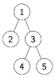

Упражнение 7
============

Асоциативни списъци
-------------------

**def. Асоциативен списък** е списък от наредени двойки `'(<ключ> . <стойност>)`. `<ключ>` и `<стойност>` могат да са произволни S-изрази.

   Примери:
   - `'((1 . 2) (4 . 2) (3 . 3))` - асоциативен списък с уникални ключове.
   - `'((1 . 2) (1 . 3) (15 . 2))` - в зависимост от проблема, който решаваме, можем да повтаряме ключове.
   - `'((1 2) (2 3) (3 1 4) (4 3 5) (5 5))` - можем да представим списък на съседство на върховете в граф чрез асоциативен списък.

   

### Задачи

1. Да се дефинира функция `run-length-encode(l)`, която
кодира списъка `l` в асоциативен списък - списък от наредени двойки `'(<ключ> . <стойност>)`,
където `<ключ>`-ът e пореден елемент от списъка `l`, а
`<стойност>`-та е колко пъти се повтаря елемента последователно.

   Например, `(run-length-encode '(8 7 7 2 2 2 2 3 3 4))`
   връща асоциативния списък `'((8 . 1) (7 . 2) (2 . 4) (3 . 2) (4 . 1))`.

2. Да се дефинира функция `run-length-decode(code)`, която
възстановява списъка, който е кодиран чрез `run-length-encode` от предната задача
в асоциативния списък `code`.

   Например, `(run-length-decode '((1 . 2) (3 . 4) (5 . 2)))`
   връща `'(1 1 3 3 3 3 5 5)`.

3. Да се дефинира функция `histogram(l)`, която
връща хистограма на срещанията на всички елементи в `l` под формата на асоциативен списък.

   Например, `(histogram '(8 7 1 7 8 2 2 8 2 7 8 1))`
   връща асоциативния списък `'((8 . 4) (7 . 3) (1 . 2) (2 . 3))`.

4. Да се дефинира функция `group-by(f, l)`, която
връща асоциативен списък, в който ключовете са стойностите на функцията `f` след прилагането ѝ върху елементи от списъка `l`, а
срещу ключовете стои списък от елементите, за които функцията `f` дава стойността от ключа.

   Например, `(group-by (lambda (x) (remainder x 3)) '(0 1 2 3 4 5 6 7 8))`
   връща асоциативния списък `'((0 0 3 6) (1 1 4 7) (2 2 5 8))`.

Дървета
-------

**def. Двоично дърво** е празният списък (`'()`) или вложен списък от три
елемента: `'(<корен> <ляво> <дясно>)`, където `<корен>` е корена на двоичното
дърво, `<ляво>` е лявото поддърво, а `<дясно>` е дясното поддърво на довичното
дърво.

   Пример:
   ```
   (1 (2 () ())
      (3 (4 () ())
         (5 () ())))
   ```

   

### Задачи

0. Да се дефинират следните основни функции за работа с двоични дървета:
- `make-tree(root, left, right)` - конструира двоично дърво по корен,
ляво и дясно поддърво.
- `root-tree(tree)` - връща корена на двоичното дърво `tree`.
- `left-tree(tree)` - връща лявото поддърво на двоичното дърво `tree`.
- `right-tree(tree)` - връща дясното поддърво на двоичното дърво `tree`.
- `empty-tree?(tree)` - проверява дали двоичното дърво `tree` е празно.
- `leaf-tree?(tree)` - проверява дали `tree` е листо.
- `tree?(tree)` - проверява дали `tree` е двоично дърво.

1. Да се дефинират функции `pre-order(tree)`, `in-order(tree)` и
`post-order(tree)`, които правят съответно корен-ляво-дясно,
ляво-корен-дясно и ляво-дясно-корен обхождане на двоичното дървото `tree`.
Функциите да връщат списък от върховете на `tree` в реда на тяхното обхождане.

2. Ниво `n` в двоично дърво наричаме списък от всички върхове на
двоичното дърво, които са на разстояние `n` от корена. Ниво 0 съдържа само
корена на дървото. Да се дефинира функция `level(n, tree)`, която връща `n`-тото
ниво в двоичното дърво `tree`.

3. Да се дефинира функция `count-leaves(tree)`, която намира броя на листата
в двоичното дърво `tree`.

4. Да се дефинира функция `map-tree(f, tree)`, която прилага функцията `f` над
всеки връх на двоичното дърво `tree`.
