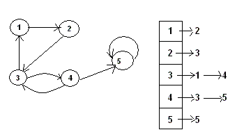

Упражнение 8
============

Дървета
-------

1. Да се дефинира функция `height(tree)`, която
намира височината на двоичното дърво `tree`.

2. Да се дефинира функция `sum-tree(tree)`, която
намира сумата на всички върхове в двоичното дърво `tree`.

3. Да се дефинира функция `max-tree(tree)`, която
намира максималната стойност в двоичното дърво `tree`.

4. Да се дефинира функция `invert(tree)`, която
връща огледалния образ на двоичното дърво `tree`.

   Например:
   ```
       4               4
      / \   invert    / \
     2   5 ========> 5   2
    / \                 / \
   1   3               3   1
   ```

5. Двоична пирамида е празното двоично дърво или е двоично дърво, в което всеки
връх е по-малък от децата си. Да се напише предикат `binary-heap?(tree)`, която
проверява дали дървото `tree` е двоична пирамида.

6. Двоично дърво е балансирано, ако:
   1. е празното двоично дърво или
   2. височините на лявото и дясното поддърво се различават най-много с 1 и
   лявото и дясното поддървета са балансирани.

   Да се напише предикат `balanced?(tree)`, която
   проверява дали дървото `tree` е балансирано.

7. Двоично наредено дърво е:
   1. празното двоично дърво или
   2. двоично дърво, в което коренът е:
      - по-голям от всички върхове в лявото поддърво и
      - по-малък или равен на всички върхове в дясното поддърво.

   Да се напише предикат `binary-search-tree?(tree)`, която
   проверява дали дървото `tree` е двоично наредено дърво.

8. Напишете функция `binary-serach-tree-insert(tree, v)`, която
вмъква върха `v` в двоичното наредено дърво `tree`.
Новополученото дърво трябва да бъде двоично наредено.

9. Напишете функция `tree-sort(l)`, която сортира списъка `l`, използвайки
двоично наредено дърво.

Графи
-----

0. Да се дефинират следните основни функции за работа с графи, представени
чрез асоциативен списък (ключовете са върховете в графа, а стойностите са
списъци от техните деца):
- `vertices(g)` - връща списък от върховете в графа `g`.
- `children(v, g)` - връща списък от децата на върха `v` в графа `g`.
- `edge?(u, v, g)` - проверява дали има ребро от върха `u` до върха `v`
в графа `g`.
- `map-children(v, f, g)` - прилага функцията `f` върху всяко дете на върха `v`
в графа `g`.
- `search-child(v, p, g)` - проверява дали съществува дете на върха `v`
в графа `g`, което удовлетворява предиката `p`.

1. Да се дефинира функция `path(graph, u, v)`, която
намира път от връха `u` до връха `v` в графа `graph`.

   Например, ако представяме графът чрез списък на съседство:
   ```
   (define g '((1 2) (2 3) (3 1 4) (4 3 5) (5 5)))
   (path g 1 4) ; връща '(1 2 3 4)
   ```

   

2. Да се дефинира функция `shortest-path(graph, u, v)`, която
намира най-късия път от върха `u` до върха `v` в графа `graph`.

3. Да се дефинира предикат `acyclic?(graph)`, който
проверява дали графът `graph` е ацикличен.
